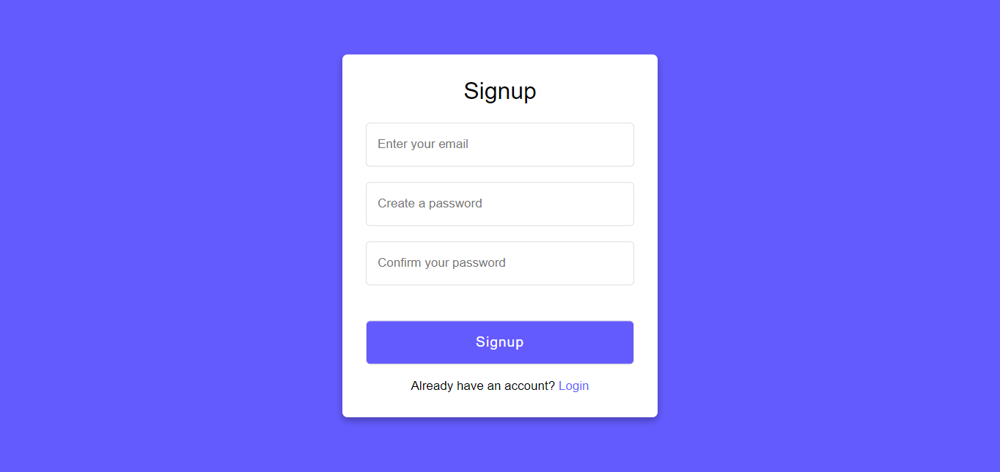

# Notes Web App

## Overview

This is a simple notes web app built using Flask for the back end and HTML, CSS, and JavaScript for the front end. Users can create an account, log in, create, edit, and delete notes. The front end design is highly inspired by [uiverse.io](https://uiverse.io), and credits are given to Google Fonts and various sources like Iconscout for fonts and icons used in the project.

## Features

- **User Authentication**: Users can sign up for an account and log in securely.
- **Create and Manage Notes**: Users can create, edit, and delete their notes.
- **Responsive Design**: The front end is designed to be responsive, providing a seamless experience across devices.

## Front End Credits

- **Design Inspiration**: The front-end design is highly inspired by [uiverse.io](https://uiverse.io).
- **Fonts**: Fonts used in the project are from [Google Fonts](https://fonts.google.com).
- **Icons**: Various icons are sourced from platforms like [Iconscout](https://iconscout.com).

## Project Structure

- **`app.py`**: Main Flask application containing the backend logic.
- **`Instance`**: Database file to save all the data.
- **`templates/`**: HTML templates for different pages.
- **`static/css/`**: CSS files for styling.
- **`static/js/`**: JavaScript files for client-side functionality.
- **`images/`**: Image assets used in the project.

## Installation

1. Clone the repository:

    ```bash
    git clone https://github.com/yourusername/Simple-Flask-Notes.git
    ```

2. Navigate to the project directory:

    ```bash
    cd Simple-Flask-Notes.git
    ```

3. Install dependencies:

    ```bash
    pip install -r requirements.txt
    ```

4. Run the application:

    ```bash
    python app.py
    ```

## Screenshots


*Homepage*


*Login Page*


*Login Page*


*Create Note Page*

## Usage

1. Access the application in your browser at `http://127.0.0.2:5000`.
2. Sign up for a new account or log in if you already have one.
3. Create, edit, or delete notes as needed.

## Notes

- The SQLite database file (`site.db`) is used for data storage.
- Ensure that the `images/` directory contains the necessary image assets.

Feel free to explore, modify, and enhance the functionality of this notes web app according to your needs! If you have any questions or issues, please [create an issue](https://github.com/yourusername/Simple-Flask-Notes/issues).


### Author

Object Tales was created by [Saurabh Tiwari](https://github.com/Rexaintreal). 

- [Email](mailto:saurabhtiwari7986@gmail.com)

### You may also like...

- [Libro Voice](https://github.com/Rexaintreal/Libro-Voice) - A PDF to Audio Converter
- [Snippet Vision](https://github.com/Rexaintreal/Snippet-Vision)- A Youtube Video Summarizer
- [Weather App](https://github.com/Rexaintreal/WeatherApp) - A Python Weather Forcast App
- [Python Screenrecorder](https://github.com/Rexaintreal/PythonScreenrecorder) - A Python Screen Recorder
- [Typing Speed Tester](https://github.com/Rexaintreal/TypingSpeedTester) - A Python Typing Speed Tester
- [Movie Recommender](https://github.com/Rexaintreal/Movie-Recommender) - A Python Movie Recommender
- [Password Generator](https://github.com/Rexaintreal/Password-Generator) - A Python Password Generator
- [Object Tales](https://github.com/Rexaintreal/Object-Tales) - A Pythpn Image to Story Generator
- [Finance Manager](https://github.com/Rexaintreal/Finance-Manager) - A Flask WebApp to Moniter Savings
- [Codegram](https://github.com/Rexaintreal/Codegram) - A Social Media Web App
